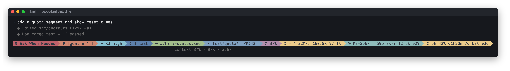
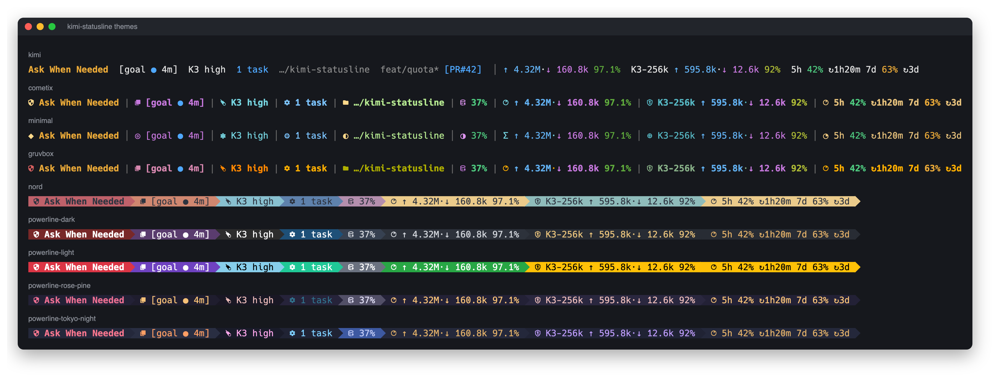
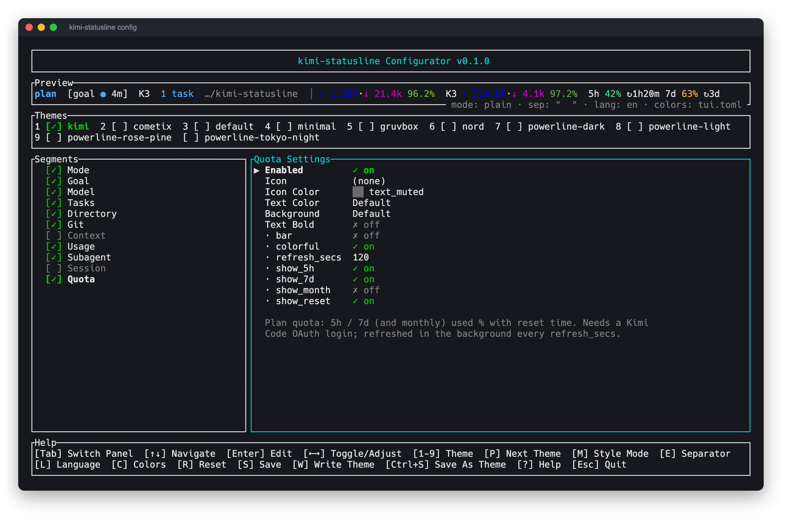
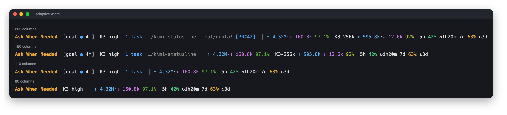

<div align="center">

# kimi-statusline

**在 Kimi Code 底栏直接看到这次会话花了多少：token、缓存命中率、套餐额度。**

[](https://github.com/Demogorgon314/kimi-statusline/releases)
[](https://github.com/Demogorgon314/kimi-statusline/actions)
[](LICENSE)


[English](README.md) | 中文



</div>

## 安装

```bash
curl -fsSL https://raw.githubusercontent.com/Demogorgon314/kimi-statusline/main/install.sh | sh
```

然后在 Kimi Code 里执行 `/reload-tui`，就这样。

<details>
<summary>Windows、Kimi 插件或源码安装</summary>

**Windows（PowerShell）**

```powershell
irm https://raw.githubusercontent.com/Demogorgon314/kimi-statusline/main/install.ps1 | iex
```

**作为 Kimi Code 插件**，在 Kimi Code 里执行：

```
/plugins install https://github.com/Demogorgon314/kimi-statusline
/reload
/new
/reload-tui
```

**从源码安装**

```bash
cargo install --git https://github.com/Demogorgon314/kimi-statusline
kimi-statusline install
```

需要 kimi-code ≥ 0.30.0。安装时不会覆盖别人的状态栏命令（需要的话加 `install --force`），本次编辑会保留注释，并将 `tui.toml` 备份为 `tui.toml.bak`。之后 Kimi Code 保存偏好设置时可能重写整个文件，届时注释仍会丢失。

Windows 下，含空格或 shell 特殊字符的路径会使用 8.3 短路径。如果文件系统没有提供可安全执行的短路径，安装会明确报错；将程序移到不含这些字符的路径后重试即可。

</details>

## 为什么用它

Kimi Code 自带的底栏只告诉你模型和目录，但不告诉你：

- 📊 **整个会话一共用了多少 token**（主 agent 加所有子 agent），以及**缓存命中率**，低红高绿
- ⏳ **5 小时和 7 天额度已用多少**、什么时候重置（`5h 42% ↻1h20m · 7d 63% ↻3d`）
- 🧩 **哪个子 agent 模型最费钱**
- 🌿 **git 状态一眼可见**：改动行数、ahead/behind、可点击的 `[PR#42]`

这些全都加上，内置底栏原有的内容也一个不少：模式、goal、模型和思考强度、后台任务，连 `/dance` 彩虹都有。

## 随心定制



10 套内置主题，从和 Kimi Code 融为一体的默认样式，到完整的 powerline。运行 `kimi-statusline` 打开配置器：



开关和排序各个段、选颜色和图标、切换主题，用你自己会话的数据实时预览。键盘和鼠标都能操作：单击选中，再点一次切换或编辑，拖动段来调整顺序，滚轮上下移动。设计参考 [CCometixLine](https://github.com/Haleclipse/CCometixLine)。

在任意 TUI 界面，**1.5 秒内连按两次 Ctrl+C** 即可退出。第一次会显示确认提示，退出时丢弃未保存的修改。

## 为速度而生

Kimi Code 在底栏重绘时运行状态栏（最多每秒一次，所以 TUI 闲置时计时和倒计时会暂停），超过 300ms 就杀掉。kimi-statusline 是单个 Rust 二进制，一次渲染约 **10–20ms**：

- 前台读取已发布的会话快照，后台 worker 负责查找会话和**增量读取**日志；冷启动时会话数据会在后续刷新出现，大日志会分多次刷新追上最新记录
- 额度、`gh pr view`、`git status`、任务和历史文件扫描都在**后台**做；worker 使用进程锁防止重复执行，PR 查询最多等待 5 秒
- 终端变窄时**自动精简**，先去掉不重要的段，而不是被截断



## 参考

<details>
<summary>所有段</summary>

| id | 内容 |
| --- | --- |
| `mode` | 权限模式 / plan / swarm / tower 徽标 |
| `goal` | `[goal ● active · 4m · 7 turns]` |
| `model` | 模型和思考强度（跟随 `/effort`）；`/dance` 后显示彩虹 |
| `tasks` | `[2 tasks running]` / `[1 agent running]` |
| `directory` | 工作目录 |
| `git` | 分支、改动统计、ahead/behind、打开的 PR（需要 `gh`） |
| `context` | 上下文占用（默认关闭，底栏第二行已经显示） |
| `usage` | 整个会话的输入 ↑ / 输出 ↓ / 缓存命中率 |
| `subagent` | 同上，针对用量最多的子 agent 模型 |
| `session` | 会话时长（默认关闭） |
| `quota` | 5h / 7d（可选月度）额度和重置时间 |
| `tps` | 生成速度：`42.1 tok/s · ×3 118 tok/s (均 40.3)`，即最近一次调用的速度（输出 token ÷ 流式输出时间，用 Kimi Code 自己记录的计时）；子 agent 并行时再显示合计吞吐（默认关闭） |

空间不够时按这个顺序去掉：session → tps → git → directory → subagent → tasks → goal → context → quota → mode。

TPS 和用量只属于当前会话：新会话从空状态开始，恢复会话时保留原统计。5h / 7d 额度属于账号，会跨会话保留。预览和配置器使用当前目录的最近会话。

Goal 徽标兼容新版 `goal.create/update/clear` 事件和旧版会话元数据。并行 TPS 使用 turn 用量记录的时间作为流结束锚点，排除等待工具的时间；缺少这类锚点的旧日志仍显示单次和平均速度，但不参与并行吞吐计算。

</details>

<details>
<summary>配置文件</summary>

`~/.kimi-code/kimi-statusline/config.toml`（自定义主题放在 `themes/<name>.toml`），格式与 CCometixLine 相同：

```toml
theme = "kimi"

[style]
mode = "plain"          # plain | nerd_font | powerline
separator = "  "        # "" 为 powerline 箭头
lang = "zh"             # 或 "en"
palette = ""            # "" 跟随 tui.toml；或 dark / light / Kimi 主题名

[[segments]]
id = "quota"
enabled = true
colors = { text = "text_dim" }   # c16 / c256 / RGB / "#rrggbb" / Kimi 配色名
options = { show_5h = true, show_7d = true, show_month = false, bar = false, refresh_secs = 120, stale_secs = 600 }
```

Kimi 配色名（`primary`、`accent`、`text_dim`、`success`、`warning`、`error` 等）会跟随 TUI 的深色或浅色主题。

</details>

<details>
<summary>额度是怎么拿到的</summary>

调用的是 Kimi Code `/usage` 同一个接口，用的是 Kimi Code 已经存在 `~/.kimi-code/credentials/` 里的登录凭据。请求在后台进行，最多每 `refresh_secs` 秒一次。

kimi-statusline 不会自己刷新登录凭据：和 Kimi Code 抢着更换 token 可能把你登出。Kimi Code 闲置太久、凭据过期时，额度会停在最后一次的数值（超过 `stale_secs` 会变暗，已过重置时间的窗口显示 `–`），下次发消息后自动更新。`kimi-statusline quota` 可以随时手动拉取。

缓存按 endpoint、凭据槽和 token 指纹隔离。退出登录会立即隐藏额度；切换账号或轮换 token 后会使用新缓存，在下次成功拉取前隐藏原登录状态的数值。缓存文件不会保存登录凭据。

</details>

<details>
<summary>命令、调试、卸载</summary>

```bash
kimi-statusline                 # 菜单：配置、安装、测试额度、检查更新……
kimi-statusline config          # 配置器
kimi-statusline themes          # 列出主题
kimi-statusline -t nord preview # 在终端里预览某个主题
kimi-statusline quota           # 立即拉取额度
kimi-statusline update          # 更新到最新版本（加 --check 只检查）
kimi-statusline uninstall       # 从 tui.toml 移除，然后 /reload-tui
```

- 调试日志：`touch ~/.kimi-code/kimi-statusline-debug`，然后看 `~/.kimi-code/kimi-statusline-debug.log`
- 插件用户：`/plugins remove kimi-statusline`，状态栏会自己清理 `tui.toml`

</details>

## 参与开发

```bash
cargo test
python3 scripts/screenshots.py   # 重新生成 assets/（需要 Chrome、ImageMagick、Nerd Font、pyte）
```

发布新版本：同步修改 `Cargo.toml` 和 `kimi.plugin.json` 里的版本号，推送 `vX.Y.Z` tag。

致谢：[CCometixLine](https://github.com/Haleclipse/CCometixLine)（配置器和主题设计）、[kimi-usage](https://github.com/YD-233/kimi-usage)（会话解析）。

## License

MIT
